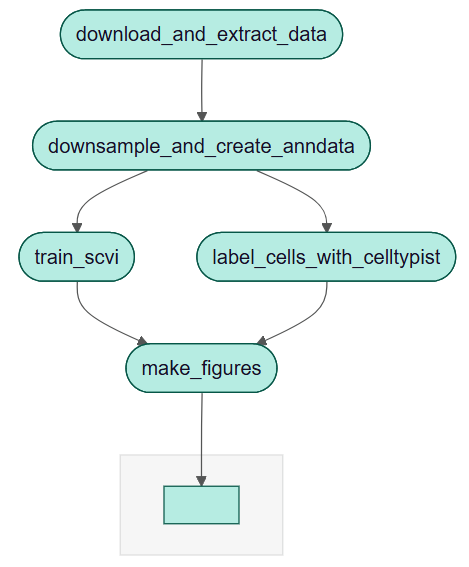
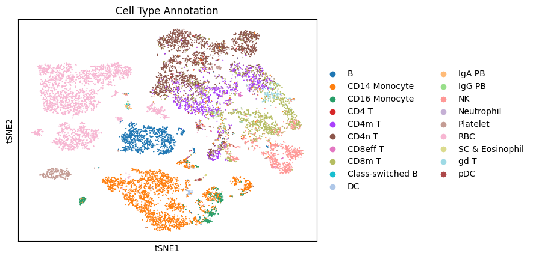
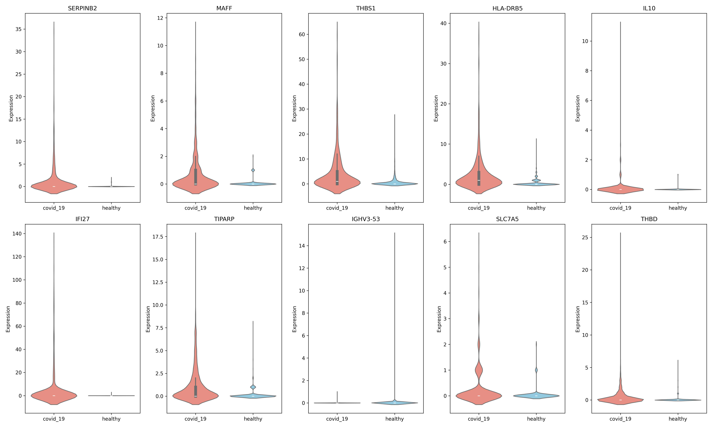

# A NextFlow Pipeline for Analysis of scRNAseq Data from COVID-19 Patients and Healthy Controls

This is a project to demonstrate analysis of scRNAseq data using a NextFlow pipeline for reproducability.

The dataset analyzed here consists of 10x Genomics scRNA-seq data of peripheral blood mononuclear cells (PBMCs) collected from six COVID-19 patients and three healthy controls (Accession number: [GSE166992](https://www.ncbi.nlm.nih.gov/geo/query/acc.cgi?acc=GSE166992)). This dataset provides a valuable opportunity to explore immune cell responses and transcriptional changes associated with COVID-19 infection at single-cell resolution.

A central goal of this analysis is to perform differential expression (DE) analysis to identify genes and pathways altered in disease states. [scVI](https://doi.org/10.1038/s41592-018-0229-2) (single-cell Variational Inference) is a deep generative model designed specifically for single-cell data that can be used for this task. Unlike traditional DE methods, scVI:

* Accounts for technical variability such as batch effects and differences in sequencing depth.

* Learns a low-dimensional latent representation of gene expression that captures the true biological signal.

* Provides probabilistic estimates of gene expression, enabling more robust and accurate differential expression analysis across cell types and conditions.

This workflow currently trains scVI on the dataset to demonstrate the analysis pipeline. Extensions built on this workflow could, for example, compare differential expression results with drug perturbation databases to identify candidates for drug repurposing or potential novel treatments for COVID-19. Alternatively, the differential expression data could be integrated with biological network databases, such as [KEGG](https://www.genome.jp/kegg/), to better understand the pathways and mechanisms activated during COVID-19 infection.

## How to Run

This workflow requires Git, Docker, and an active internet connection.

**Step 1: Clone the git repository**

```
git clone https://github.com/JoshD898/BIOF-501-NextFlow.git
cd BIOF-501-NextFlow
```

At this point, your project folder should look something like this:
```
.
|   .gitignore
|   dockerfile
|   main.nf
|   README.md
|
\---res
|       top10_violin_plots.png
|       tsnesne_cell_type.png
|       workflow.png
|
\---scripts
        download_and_extract_data.py
        downsample_and_create_anndata.py
        label_cells_with_celltypist.py
        make_figures.py
        train_scvi.py
```
**Step 2: Build the Docker image**

```
docker build -t gse166992-img -f dockerfile .
```

**Step 3: Mount the project directory and run the Nextflow pipeline**

```
docker run --rm -it -v "${PWD}:/workspace" -w /workspace gse166992-img nextflow run main.nf -resume
```

*Note: The docker image and scripts are intended to only run on a CPU. Attempting to run with a GPU will likely not work without modifying the codebase. The total runtime should be around 1 hour.*

## Pipeline Overview

### **Figure 1: Project Workflow**



The workflow can be broken down into the following steps:

1. Download and preparation of the dataset from the NCIB GEO Database
    * The database is queried automitically in this workflow, so no need to get the data yourself
2. Downsampling of the data for testing purposes
    * Between all the patients there are over 60 000 cells, with more than 30 000 genes measured per cell
    * To speed up the training of scVI, only 2000 cells per patient are randomly carried forward for analysis
3. Train scVI
    * To reduce training time, the model is trained for only 30 epochs before saving the final model.
4. Label cells with celltypist
    * It's important to label the cell types in order compare gene expression within cell subsets
    * Celltypist is just one of many available methods for this
5. Create figures
    * Two reprasentative figures are produced:
        * A t-SNE plot of the scVI latent variables colored by celltypist labels
        * Violin plots of the 10 most differntially expressed genes in CD14 Monocytes


*Note: Downsampling was performed to allow the workflow to run in less than 1 hour. Parmameters to control the downsampling, scVI training and the cell labeling model can all be adjusted in the `main.nf` file.*


## Expected Output

After running the NextFlow Workflow, there should now be an `output` folder that contains the trained scVI model, downsampled raw data labelled with celltypist, and two figures similar to the ones shown below.

### **Figure 2: t-SNE of scVI Latent Variables Labeled with Celltypist**


### **Figure 3: Violin Plots for Top 10 Differentially Expressed Genes in CD14 Monocytes**



*Note: I wouldn't put a lot of weight in the figures. The aggressive downsampling and scVI training shortcuts don't make the results too trustworthy. These just serve as examples to show that the workflow runs successfully.*


## Docker Image details
```
docker run --rm gse166992-img nextflow -v
> nextflow version 25.10.2.10555

docker run --rm gse166992-img python --version
> Python 3.10.19

docker run --rm gse166992-img pip freeze
> Package                 Version
> ----------------------- -----------
> absl-py                 2.3.1
> aiofiles                25.1.0
> aiohappyeyeballs        2.6.1
> aiohttp                 3.13.2
> aiosignal               1.4.0
> anndata                 0.11.4
> array-api-compat        1.12.0
> async-timeout           5.0.1
> attrs                   25.4.0
> celltypist              1.7.1
> certifi                 2025.11.12
> charset-normalizer      3.4.4
> chex                    0.1.90
> click                   8.3.1
> contourpy               1.3.2
> cycler                  0.12.1
> docrep                  0.3.2
> et_xmlfile              2.0.0
> etils                   1.13.0
> exceptiongroup          1.3.1
> filelock                3.20.0
> flax                    0.10.7
> fonttools               4.61.0
> frozenlist              1.8.0
> fsspec                  2025.10.0
> grpcio                  1.76.0
> h5py                    3.15.1
> humanize                4.14.0
> idna                    3.11
> igraph                  1.0.0
> importlib_resources     6.5.2
> jax                     0.6.2
> jaxlib                  0.6.2
> Jinja2                  3.1.6
> joblib                  1.5.2
> kiwisolver              1.4.9
> legacy-api-wrap         1.5
> leidenalg               0.11.0
> lightning               2.6.0
> lightning-utilities     0.15.2
> llvmlite                0.45.1
> Markdown                3.10
> markdown-it-py          4.0.0
> MarkupSafe              3.0.3
> matplotlib              3.10.7
> mdurl                   0.1.2
> ml_collections          1.1.0
> ml_dtypes               0.5.4
> mpmath                  1.3.0
> msgpack                 1.1.2
> mudata                  0.3.2
> multidict               6.7.0
> multipledispatch        1.0.0
> natsort                 8.4.0
> nest-asyncio            1.6.0
> networkx                3.4.2
> numba                   0.62.1
> numpy                   2.2.6
> numpyro                 0.19.0
> openpyxl                3.1.5
> opt_einsum              3.4.0
> optax                   0.2.6
> orbax-checkpoint        0.11.30
> packaging               25.0
> pandas                  2.3.3
> patsy                   1.0.2
> pillow                  12.0.0
> pip                     23.0.1
> propcache               0.4.1
> protobuf                6.33.1
> psutil                  7.1.3
> Pygments                2.19.2
> pynndescent             0.5.13
> pyparsing               3.2.5
> pyro-api                0.1.2
> pyro-ppl                1.9.1
> python-dateutil         2.9.0.post0
> pytorch-lightning       2.6.0
> pytz                    2025.2
> PyYAML                  6.0.3
> requests                2.32.5
> rich                    14.2.0
> scanpy                  1.11.5
> scikit-learn            1.7.2
> scipy                   1.15.3
> scvi-tools              1.3.3
> seaborn                 0.13.2
> session-info2           0.2.3
> setuptools              79.0.1
> simplejson              3.20.2
> six                     1.17.0
> sparse                  0.17.0
> statsmodels             0.14.5
> sympy                   1.14.0
> tensorboard             2.20.0
> tensorboard-data-server 0.7.2
> tensorstore             0.1.78
> texttable               1.7.0
> threadpoolctl           3.6.0
> toolz                   1.1.0
> torch                   2.9.1+cpu
> torchmetrics            1.8.2
> tqdm                    4.67.1
> treescope               0.1.10
> typing_extensions       4.15.0
> tzdata                  2025.2
> umap-learn              0.5.9.post2
> urllib3                 2.5.0
> Werkzeug                3.1.4
> wheel                   0.45.1
> xarray                  2025.6.1
> yarl                    1.22.0
> zipp                    3.23.0
```
